# DeepSeek++ Harness · DeepSeek 网页模型 × 本机 Agent

在本机 **DeepSeek Harness 网页**里聊天、读写项目文件、执行命令，模型使用浏览器中已经登录的 **DeepSeek 网页版**。

**不需要模型 API Key，不需要给 agent 配置其他模型。Windows 原生命令使用 PowerShell 7，不要求 WSL。**

日常流程：**首次安装并配对 → 运行 `dsh web` → 在 Harness 网页里使用。**

[English](README_EN.md) · [首次安装](#首次安装) · [首次配对](#首次配对只做一次) · [日常使用](#日常使用) · [模式与深度思考](#模式与深度思考) · [执行命令](#执行命令) · [升级](#升级)

## 能力

本项目在 [DeepSeek++](https://github.com/zhu1090093659/deepseek-pp) 浏览器扩展的基础上，增加了与本机 Harness 的连接，并提供配套的 DSH 插件：

- **网页模型接入**：让 Harness 使用已登录的 DeepSeek 网页会话进行推理。
- **完整 Agent 工作流**：由 Harness 管理多轮对话、上下文、文件工具、Skills、子 Agent 和任务执行。
- **图形化配置**：在 Harness 设置中填写扩展 ID、配对、查看连接状态和设置命令权限。
- **模式与深度思考**：选择默认或专家模式，独立开启或关闭思考；既可设置新会话默认值，也可在会话中选择。
- **中英文设置界面**：跟随 Harness 语言，支持折叠分组和浅色、深色主题。
- **会话保存与继续**：重新打开 Harness 后继续已有对话，也可导入已结束的独立 DeepSeek Web Agent 会话。
- **Windows / Linux 命令**：Windows 使用 PowerShell 7；Linux 使用官方 Bash 与沙箱机制。
- **保留原有环境**：与 Harness 的其他模型共存，也保留 DeepSeek++ 原有的浏览器内功能。

Harness 插件和浏览器扩展各有分工：Harness 负责本地任务与工具，DeepSeek++ 负责连接网页模型。浏览器内的记忆、MCP 等配置与 Harness 的插件配置分别管理。

## 首次安装

已完成安装和配对，可以直接看[日常使用](#日常使用)。

### 1. 准备环境

需要 **Node.js 24.x、pnpm `11.7.0`、DeepSeek Harness `0.1.2-rc.1`**，以及 Chrome、Edge 或 Firefox。Harness 和登录 DeepSeek 的浏览器须在同一台电脑运行。pnpm 用于安装 Harness 插件，下面的命令会一并安装。

请使用上述 Harness 版本及安装包内的配套依赖，它们与插件的模型、工具和设置接口配套。

以下命令安装本机运行环境；已有的软件可跳过。源码构建还需要 Git。

**Windows**

在终端中安装 Node.js 24 和 PowerShell 7：

```powershell
winget install --id OpenJS.NodeJS.LTS --version 24.19.0 --exact --source winget
winget install --id Microsoft.PowerShell --exact --source winget
```

安装后重新打开 **PowerShell 7**，安装 pnpm 和本机 Harness：

```powershell
npm install --global pnpm@11.7.0
npm install --global @deepseek-ai/dsh@0.1.2-rc.1
```

也可使用 [Node.js 安装程序](https://nodejs.org/en/download)选择 24.x，以及 [PowerShell 官方安装方法](https://learn.microsoft.com/powershell/scripting/install/install-powershell-on-windows)。日常运行 Harness 不需要管理员权限。

使用完整安装包不需要 Git；选择源码构建时，再执行 `winget install --id Git.Git --exact --source winget`。

**Linux（Ubuntu / Debian 示例）**

安装 Git、Bash 和 Bubblewrap 沙箱：

```bash
sudo apt update
sudo apt install -y git curl ca-certificates bash bubblewrap
```

通过 [nvm](https://github.com/nvm-sh/nvm) 安装当前用户的 Node.js 24，再安装 Harness。已有 nvm 时可跳过第一行：

```bash
curl -o- https://raw.githubusercontent.com/nvm-sh/nvm/v0.40.4/install.sh | bash
export NVM_DIR="$HOME/.nvm"
. "$NVM_DIR/nvm.sh"
nvm install 24
nvm use 24
npm install --global pnpm@11.7.0
npm install --global @deepseek-ai/dsh@0.1.2-rc.1
```

其他 Linux 发行版使用各自的软件包管理器安装 Bash 和 Bubblewrap；官方 Harness 也可使用可用的 Landlock 后端。Node/npm 和 Harness 使用普通用户运行。

### 2. 获取浏览器扩展和 Harness 插件

这两项是不同的软件：**浏览器扩展安装到浏览器，DSH 插件安装到本机 Harness。**

从 [GitHub Releases](https://github.com/XVSHIFU/deepseek-pp/releases) 的附件（Assets）中选择 **完整安装包 `deepseek-web-harness-20260909.zip`**，不需要另找扩展补丁。已经拿到这份整包时，直接解压使用，不必再次下载。不要选择 GitHub 自动生成的 **Source code**。

解压整包后，进入 **`deepseek-web-harness-20260909`** 文件夹，里面同时有 **`README.md`、`extensions`、`plugin`、`vendor`**。以下称这一层为“安装包目录”，安装和升级命令都在这一层执行。

使用配套安装包时，解压到准备长期保留的目录。浏览器 ZIP 位于 `extensions/`，DSH 插件位于 `plugin/`，配套依赖位于 `vendor/`；无需执行下面的源码构建。

<details>
<summary>从源码构建：没有使用配套安装包时展开</summary>

Windows、Linux 均可执行：

```sh
git clone --branch feature/web-harness https://github.com/XVSHIFU/deepseek-pp.git
cd deepseek-pp
npm ci
```

**构建浏览器扩展：**

```sh
npm run build:chrome
```

Edge 改为 `npm run build:edge`，Firefox 改为 `npm run build:firefox`。输出分别位于 `dist/chrome-mv3`、`dist/edge-mv3`、`dist/firefox-mv3`。

**构建 Harness 插件：**

```sh
npm run build --workspace @deepseek-pp/dsh-deepseek-web-official-plugin
```

任一步出错时先停止，解决后再继续。

</details>

### 3. 安装 Harness 插件

插件通过官方 `dsh plugin --profile web add` 安装。安装一次后，配对和日常配置在 Harness 网页里完成。

**使用配套安装包：** 在解压后的目录打开终端，执行对应系统的命令。

Windows（PowerShell 7）：

```powershell
$vendor = @(Get-ChildItem -LiteralPath ./vendor -Filter '*.tgz' | Select-Object -ExpandProperty FullName)
$plugin = @(Get-ChildItem -LiteralPath ./plugin -Filter '*.tgz' | Select-Object -ExpandProperty FullName)
dsh plugin --profile web add $vendor $plugin --allow-build=koffi
```

Linux（Bash）：

```bash
dsh plugin --profile web add ./vendor/*.tgz ./plugin/*.tgz --allow-build=koffi
```

<details>
<summary>从源码构建后的安装命令</summary>

在仓库目录中执行。

Windows（PowerShell 7）：

```powershell
New-Item -ItemType Directory -Force .release/manual | Out-Null
npm pack --workspace @deepseek-pp/dsh-deepseek-web-official-plugin --ignore-scripts --pack-destination .release/manual
if ($LASTEXITCODE -ne 0) { throw '打包失败，请先解决错误' }
$vendor = @(Get-ChildItem -LiteralPath ./vendor/harness-request-budget -Filter '*.tgz' | Select-Object -ExpandProperty FullName)
dsh plugin --profile web add $vendor ./.release/manual/deepseek-pp-dsh-deepseek-web-official-plugin-0.0.0-private.tgz --allow-build=koffi
```

Linux（Bash）：

```bash
mkdir -p .release/manual
npm pack --workspace @deepseek-pp/dsh-deepseek-web-official-plugin --ignore-scripts --pack-destination .release/manual &&
dsh plugin --profile web add ./vendor/harness-request-budget/*.tgz ./.release/manual/deepseek-pp-dsh-deepseek-web-official-plugin-0.0.0-private.tgz --allow-build=koffi
```

</details>

插件与三份配套依赖一起安装；`--allow-build=koffi` 允许所需的原生依赖完成安装。安装过程需要联网，不会移除已有的其他模型或会话。

### 4. 加载浏览器扩展

**Chrome / Edge：**

这里要**解压两次**：先解压配套整包，再解压其中的浏览器扩展 ZIP。

1. 打开上述“安装包目录”，确认里面有 `extensions`、`plugin`、`vendor`。
2. 进入 `extensions` → `chrome`（Edge 进入 `extensions` → `edge`）。
3. 找到 `deepseek-plus-plus-1.14.0-chrome.zip`（Edge 对应 `…-edge.zip`），右键选择“全部解压”。**不要直接选择 ZIP 文件。**
4. 打开刚解压出来的文件夹，找到与 `_locales`、`assets` 等扩展资源放在一起的 `manifest.json`。如果外面还有一层文件夹，就继续进入。
5. 在浏览器地址栏输入 `chrome://extensions`（Edge 是 `edge://extensions`），开启右上角“开发者模式”。
6. 点击“加载已解压的扩展程序”，选择**第 4 步找到的文件夹**，不是 `manifest.json` 文件本身。
7. 记下扩展卡片上的 **ID**，并确保只启用一份 DeepSeek++。本扩展名称为 **DeepSeek++ Harness**，不要与原版 DeepSeek++ 混用。

目录示意：只加载最内层的扩展文件夹。

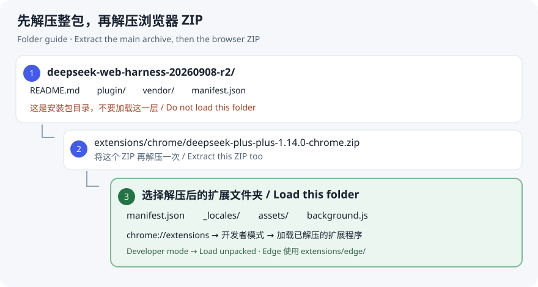

选对后，浏览器会显示扩展卡片。请长期保留这个扩展文件夹，浏览器从这里加载文件。源码构建直接选择 `dist/chrome-mv3` 或 `dist/edge-mv3`，无需再解压。

**Firefox：** 解压 Firefox ZIP，打开 `about:debugging#/runtime/this-firefox`，选择“临时载入附加组件”，打开扩展目录中的 `manifest.json`。配对时使用该扩展的 `moz-extension://…` 地址。临时加载在浏览器退出后失效；重载后的地址如有变化，需更新配对设置。

安装完成后，打开 [DeepSeek 网页](https://chat.deepseek.com)，登录并刷新页面。

**如果使用 WSL Ubuntu + Windows 浏览器：**

- Node.js、pnpm、Harness 和 DSH 插件按 Linux 步骤装在 Ubuntu 中，`dsh web` 也在 Ubuntu 中运行。
- 浏览器扩展装在 Windows 的 Chrome / Edge 中。最简单的方式是在 Windows 也解压一份整包，只取其中的浏览器扩展；这不会重复安装 Harness。
- 要从 Windows 查看 Ubuntu 的安装包目录，可在该 Ubuntu 目录执行 `explorer.exe .`。建议把解压后的扩展文件夹复制到 Windows 的固定目录再加载。
- 配对填写 **Windows 浏览器**中的扩展 ID；项目文件和命令由 Ubuntu 中的 Harness 处理，不需要安装 Shell Local。

## 首次配对（只做一次）

1. 在要处理的项目目录打开终端，运行：

   ```sh
   dsh web
   ```

   保持终端运行，在自动打开的 Harness 网页中继续配置。

2. 在 **设置 → 插件** 中找到 **DeepSeek 网页模型**，点击标题或箭头展开。在“连接”区域选择浏览器，填写刚才记下的扩展 ID；Firefox 填完整 `moz-extension://…` 地址。端口保留 **43123**。
3. 在“网页模型”区域选择“默认模式”，先关闭思考，勾选 **将 DeepSeek 网页模型设为以后新会话的默认模型**，点击 **保存设置**。保存成功后卡片会收起，再点标题展开即可。
4. 在“配对”区域点击 **生成配对令牌**，再点 **复制**。已有配对时不必重新生成。
5. 在浏览器工具栏点击 **DeepSeek++ Harness** 图标，进入扩展的 **设置 → 本机 Harness**：开启桥接，端口填 **43123**，粘贴令牌，点击“保存”。注意：这里是浏览器扩展的设置，不是 Harness 网页的设置。
6. 显示“**已连接**”后，在 Harness 中新建会话即可开始使用。

配对令牌只在生成时显示，请妥善保管。扩展 ID 和令牌会保存，不需要每天重新填写。

**Harness 这一侧：** 先展开“DeepSeek 网页模型”，填写你自己浏览器中的扩展 ID。图中的 ID 仅用于示意，不要照抄。

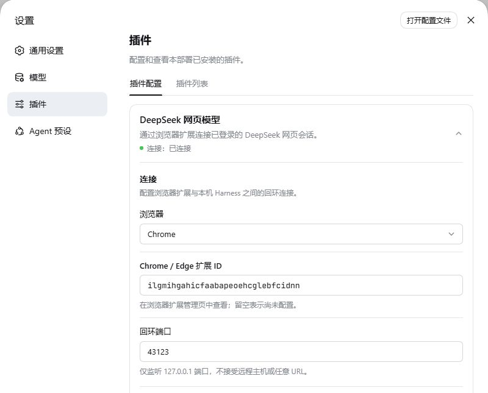

**浏览器扩展这一侧：** 在“设置 → 本机 Harness”粘贴令牌，点击右下角“保存”。下图用于标示填写位置，显示的是尚未连通时的“等待重试”；完成配置后应为“已连接”。

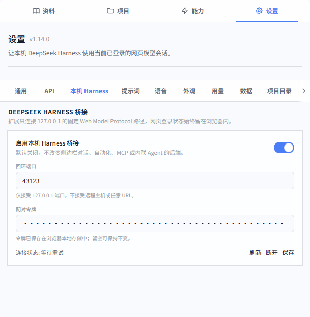

如果 Harness 使用英文，卡片名为 **DeepSeek Web model**，对应按钮为 **Save settings / Generate pairing token / Copy**。设置语言跟随 Harness，无需单独配置。

## 日常使用

保持 DeepSeek 网页登录并打开，在要处理的项目目录运行：

```sh
dsh web
```

在 Harness 左侧选择要处理的工作区；尚未出现时，点击“添加工作区”选择项目目录。新建会话后，确认模型选择器显示 **DeepSeek Web (Default)** 或 **DeepSeek Web (Expert)**，即可发送任务，例如：

- “读取 README.md，用中文说明这个项目是做什么的。”

  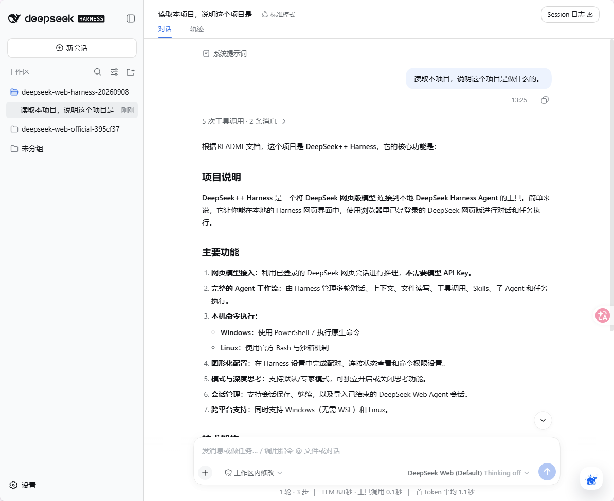
- “阅读这个模块，解释各个文件的作用。”
- “修改 README 的项目说明，并告诉我改了什么。”
- 创建文件夹、写文件、审批

  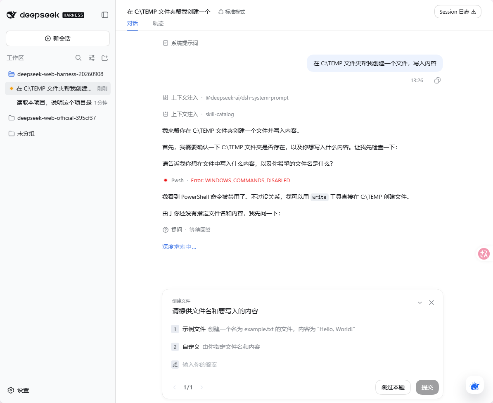

  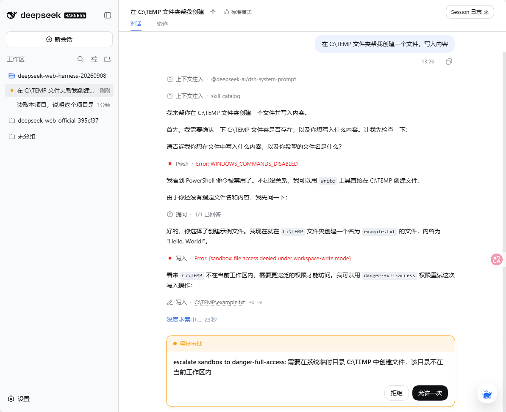

​	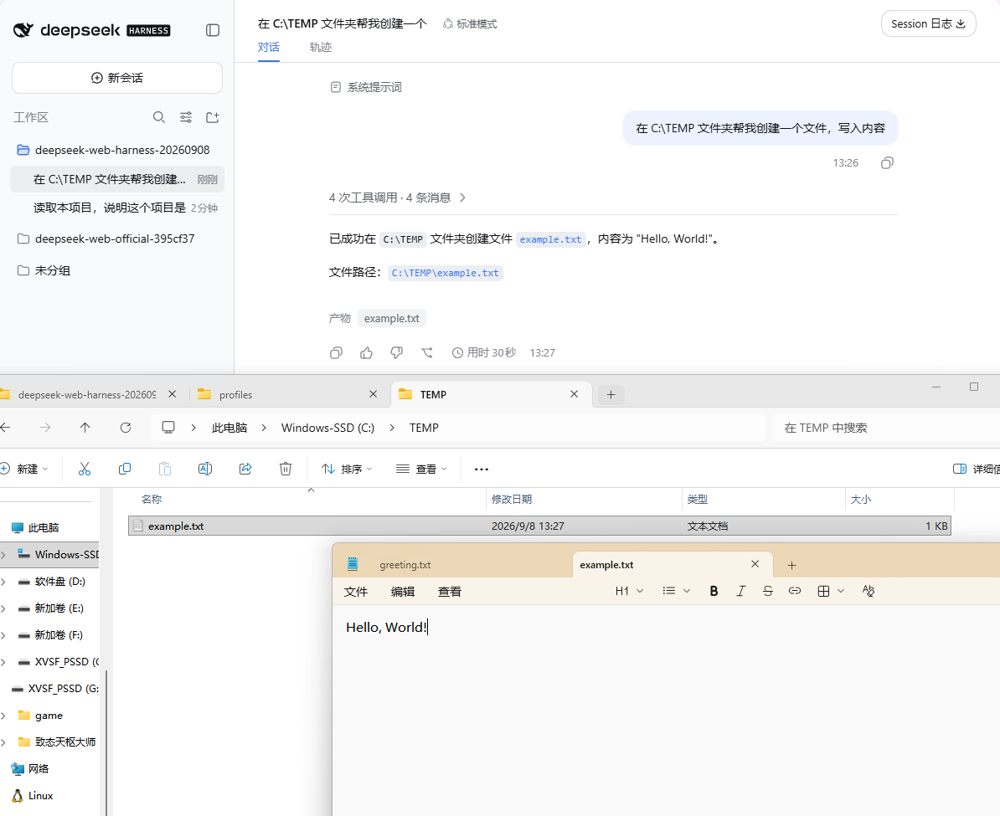


Linux-wsl-ubuntu:

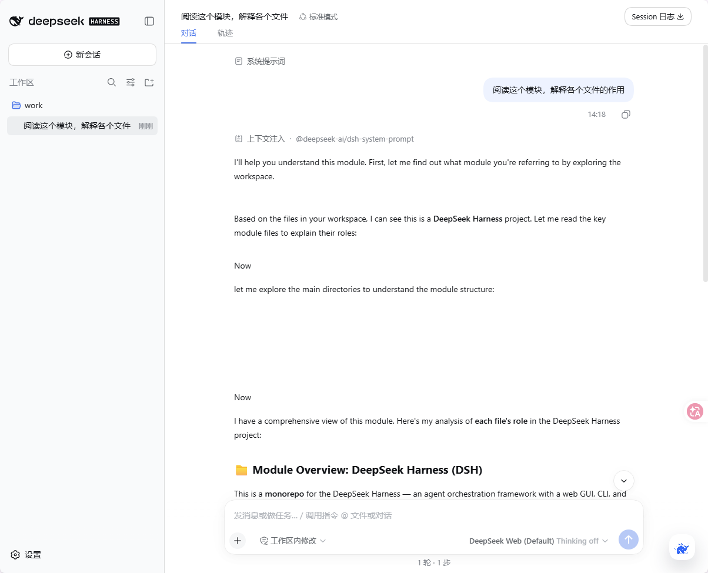

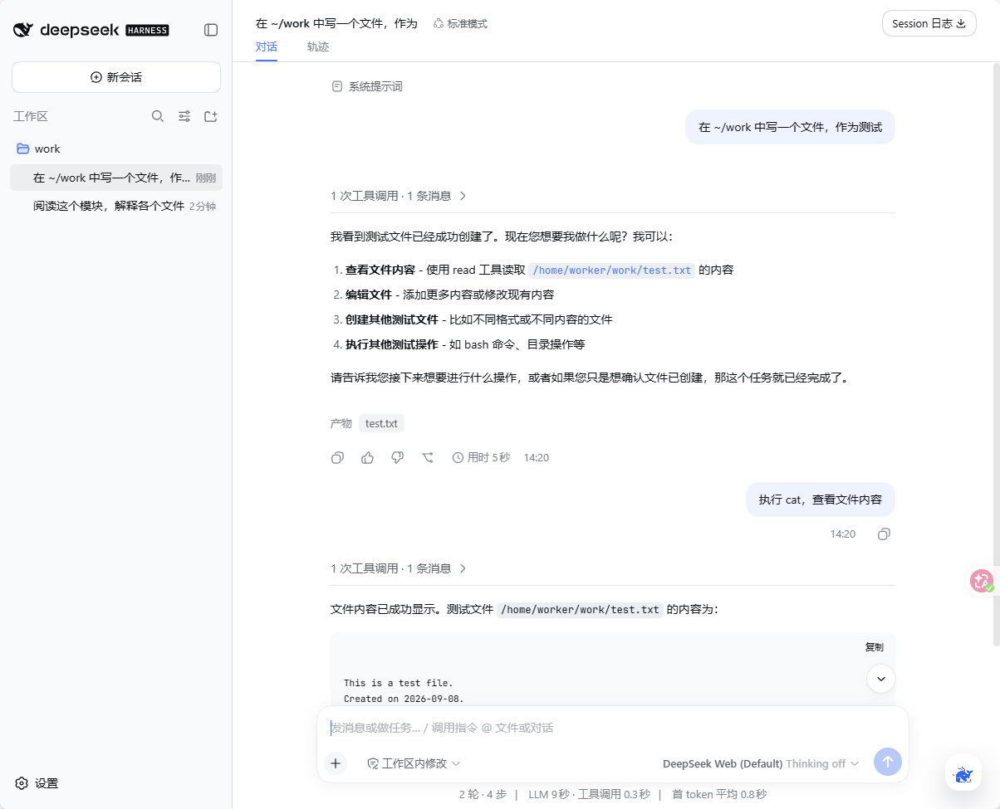

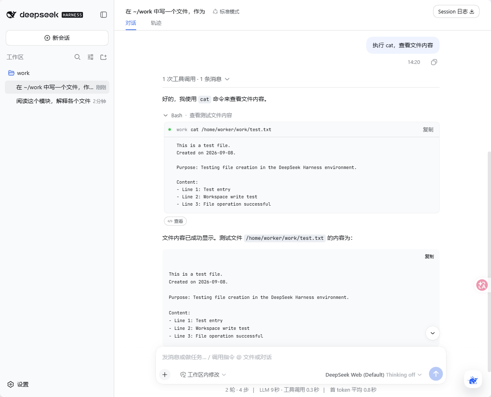

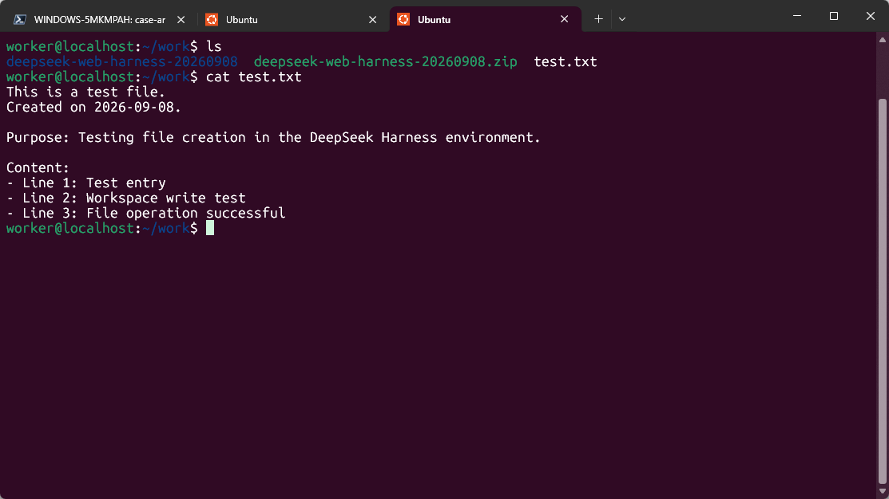


用完在终端按 `Ctrl+C` 停止服务，下次仍用 `dsh web` 打开。浏览器和 DeepSeek 网页需要保持可用，才能继续使用网页模型。

提示需要登录时，刷新已登录的 DeepSeek 页面后再发送任务；显示未连接时，先确认 `dsh web` 仍在运行，再到扩展的“本机 Harness”中保存连接设置。不必因此卸载或重新安装。

浏览器扩展的 **设置 → 本机 Harness → 模型请求最小间隔（秒）** 默认是 **5 秒**，可调至 **30 秒**，同一扩展连接的 Harness 会话共用。若提示“消息发送过于频繁”，先等待；连续限流时冷却会延长。已完成的工具结果保留，核对进度后可在 Harness 新建或分支会话继续，不要反复重发失败任务。

## 模式与深度思考

**设置以后新会话的默认值：** 展开 **设置 → 插件 → DeepSeek 网页模型 → 网页模型**，选择“默认模式”或“专家模式”，按需开启“为新会话启用思考”，保存设置。要让新会话使用这里的选择，请同时启用“将 DeepSeek 网页模型设为以后新会话的默认模型”。

**调整当前会话：** 使用 Harness 会话内的模型选择器，选择 **DeepSeek Web (Default)** 或 **DeepSeek Web (Expert)**；思考选项为 **Thinking off / Thinking on**。等待当前回复结束后再调整，选择作用于后续回合，不改变其他会话。

下图中的模式、思考开关与“以后新会话的默认模型”是三个独立设置；需要默认使用网页模型时，开启第三项后保存。

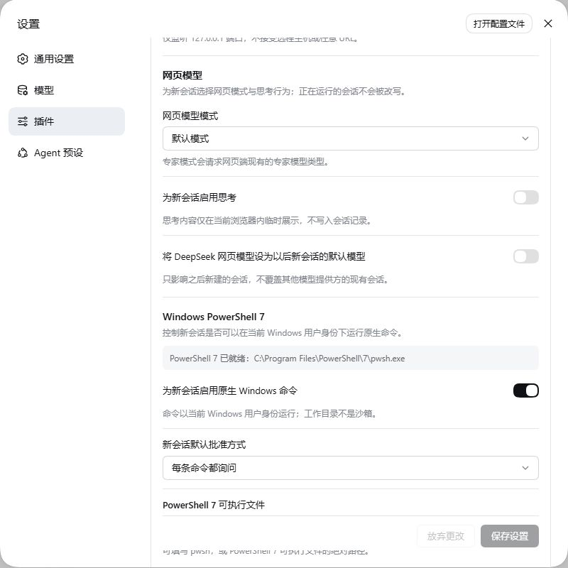

- 默认模式与专家模式都可以独立开启或关闭思考，并非“专家模式就是开启思考”。

  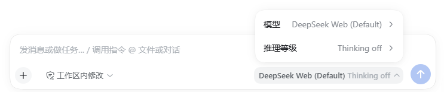

  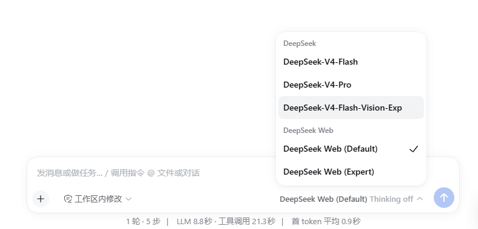
- 开启思考后，可展开会话中的“思考中…”或“已思考”区域；思考内容仅临时展示，刷新页面后不从历史恢复，最终回答和工具结果照常保留。
- 以 Harness 中的选择为准，不需要到 DeepSeek 网页上手动切换模式。
- 此连接用于文字对话和本机工具任务，不提供图片上传或识图入口。

## 执行命令

**在 Harness 中执行命令，不需要开启浏览器扩展的 MCP → Shell Local。** Windows 命令需开启下面的 Harness 插件开关，工作区“完全权限”不能代替该开关。WSL 中运行 Harness 时，命令在 Ubuntu 中执行，浏览器可使用 Windows 上已配对的 Chrome / Edge。

### Windows：PowerShell 7

展开 **设置 → 插件 → DeepSeek 网页模型 → Windows PowerShell 7**，开启 **为新会话启用原生 Windows 命令**，批准方式选择 **每条命令都询问**。可执行文件填写 `pwsh`，或 PowerShell 7 的完整路径；保存设置后，**再新建会话**。

例如发送“执行 `Get-Location`，告诉我当前目录”，检查网页中的命令批准请求后选择“允许一次”。

图中已开启 Windows 命令，并选择“每条命令都询问”。下方“配对”显示已保存令牌时，无需再次生成。

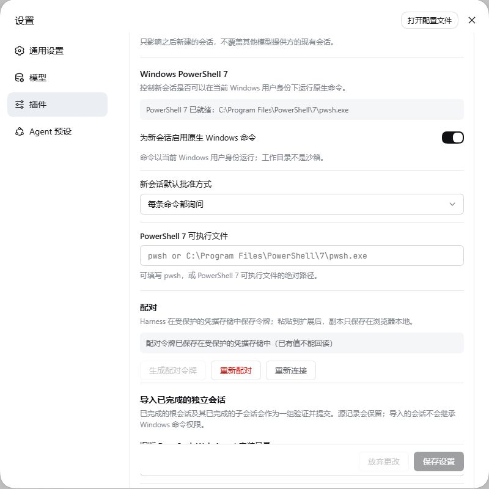

命令以运行 Harness 的当前 Windows 用户权限执行，不局限于项目目录。原生命令默认关闭，自动批准需要单独开启。

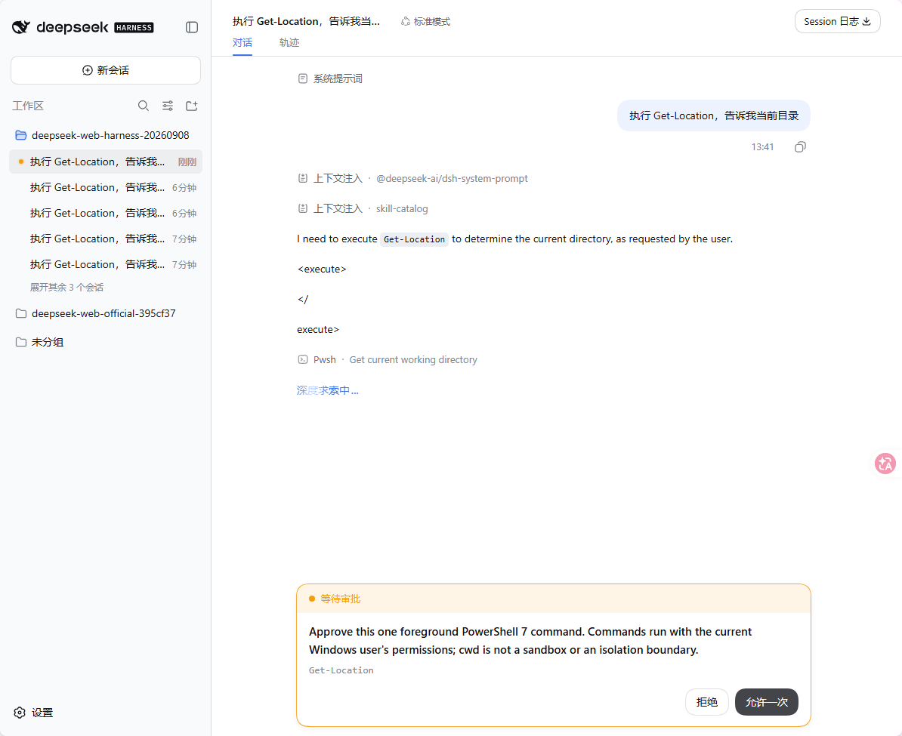

可以看到调用了工具执行了命令

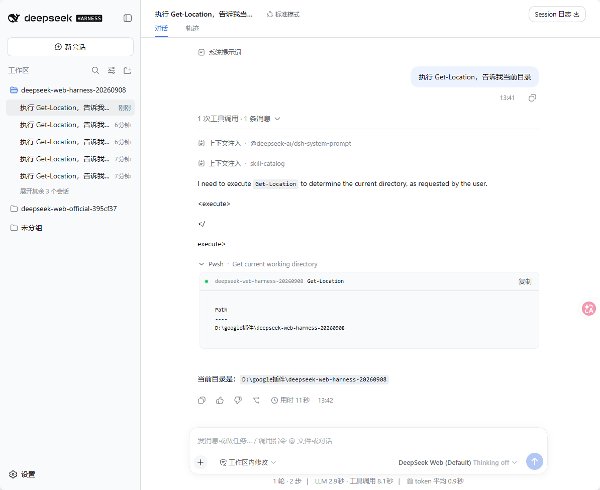


### Linux：Bash

使用官方 Harness 的 `workspace-write + ask` 默认设置：普通命令在工作区文件沙箱中执行，需要扩大文件权限时请求批准。

执行命令需要可用的 Bubblewrap 或 Landlock 后端。文件沙箱不等于网络隔离。

## 升级

使用完整安装包升级时，按下面步骤更新配套文件，不混用不同整包中的组件。若取得的是明确标注“仅浏览器扩展”的更新包，则按该包说明操作，无需重复安装未变化的 Harness 插件。

1. 在运行 Harness 的终端按 `Ctrl+C` 停止服务，保留旧安装包以便回退。
2. 进入新“安装包目录”，执行对应系统的更新命令：

   Windows（PowerShell 7）：

   ```powershell
   $vendor = @(Get-ChildItem -LiteralPath ./vendor -Filter '*.tgz' | Select-Object -ExpandProperty FullName)
   $plugin = @(Get-ChildItem -LiteralPath ./plugin -Filter '*.tgz' | Select-Object -ExpandProperty FullName)
   dsh plugin --profile web add $vendor $plugin --force --allow-build=koffi
   ```

   Linux（Bash）：

   ```bash
   dsh plugin --profile web add ./vendor/*.tgz ./plugin/*.tgz --force --allow-build=koffi
   ```

   等命令成功退出后再继续；首次安装和升级都可能需要联网。

3. 解压新包中的浏览器扩展 ZIP。**先备份原来加载的扩展文件夹**，再将新扩展文件复制到原文件夹内并覆盖同名文件；让浏览器继续使用原路径，不要先卸载扩展。
4. 在 `chrome://extensions` 或 `edge://extensions` 点击该扩展的“重新加载”，然后刷新已经登录的 DeepSeek 网页。Firefox 重新临时加载后，如扩展地址变化，需在 Harness 中更新并配对。
5. 回到项目目录运行 `dsh web`。原路径与扩展 ID 没变时，已有配对可继续使用；在设置中确认“已连接”。

旧配置会自动补足默认的 5 秒请求间隔，无需重新配对。若要回退版本，请同时恢复升级前备份的扩展配置及配套组件；不要直接用旧扩展读取新版配置。

## 数据与权限

任务中读取的文件和工具结果会作为模型上下文送到 DeepSeek 网页。请选择允许模型处理的项目，避免提供密钥或无关的敏感文件，并在批准命令前检查其内容。

## 友情链接

- [OfficeCLI](https://github.com/iOfficeAI/OfficeCLI) — AI-friendly CLI for Office 文档处理
- [1flowbase](https://github.com/taichuy/1flowbase) — 开源虚拟模型网关，可将多模型工作流发布为 OpenAI / Claude 兼容端点
- [FrontAgent](https://github.com/FrontAgent/FrontAgent) — 面向前端工程的 AI Agent 平台，支持 RAG、Skills、SDD、MCP、CLI 和 VS Code 插件等能力
- [MuseAI](https://github.com/yejiming/MuseAI) — AI 角色与故事互动项目，可创建角色、进入故事世界并持续互动
- [Spec Driven Develop](https://github.com/zhu1090093659/spec_driven_develop) — 面向 AI 编程代理的规范驱动开发方法
- [Awesome-Prompts 角色扮演](https://github.com/dongshuyan/Awesome-Prompts/tree/master/%E8%A7%92%E8%89%B2%E6%89%AE%E6%BC%94) — 精选角色扮演 Prompt 合集
- [LINUX DO](https://linux.do) — 新一代开源技术社区

## 致谢与许可

基于 [DeepSeek++](https://github.com/zhu1090093659/deepseek-pp) 和 [DeepSeek Harness](https://github.com/deepseek-ai/deepseek-harness) 的插件机制构建。感谢上游作者和贡献者。

## License

本仓库遵循 Apache-2.0；配套 Harness 归档遵循 MIT，保留各自的许可文件。
