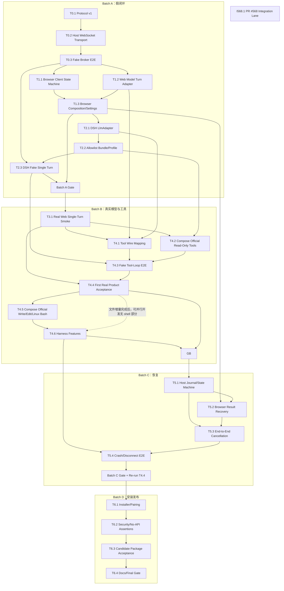
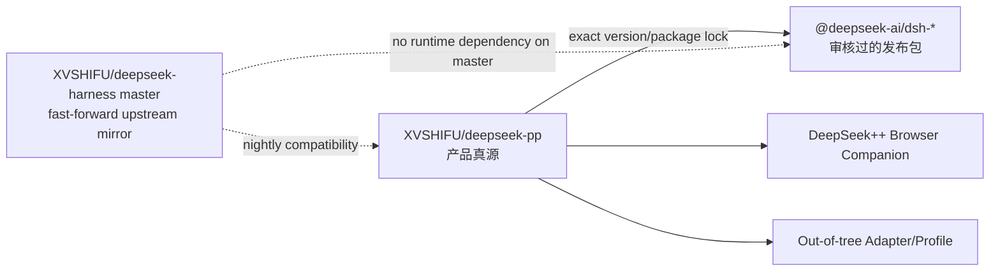
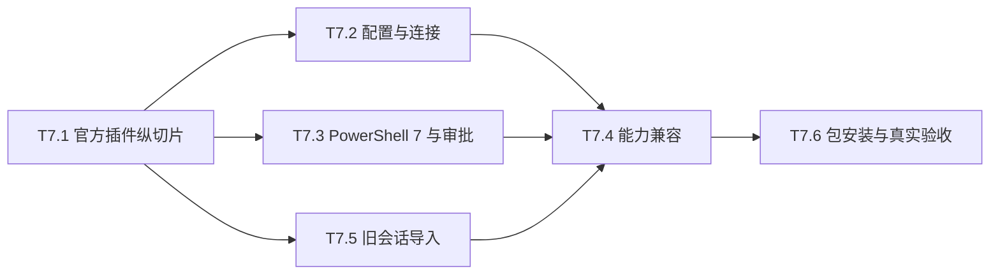

# DeepSeek Web Harness Dependency Graph

本图只描述 Mode A：本机 DSH 控制 Agent loop/session/context/tools，DeepSeek++ Browser Broker 是唯一模型通道。不存在第二条产品主线。

## 1. 关键路径



`I568.1` 故意没有指向核心节点的依赖边。它可以随时开始、合并或 deferred；不得阻塞 T0.1 至 T6.4。若决定纳入某个候选版本，只在 T6.3 记录“included/deferred”，不改变 Broker 关键路径。

## 2. 批次与硬门

| Gate | 必须完成 | 允许执行的完整检查 | 解锁 |
|:--|:--|:--|:--|
| Batch A Gate | T0.1-T2.3 和 T1.1-T1.3 | 一次 `npm run compile`、一次 `npm test` | 真实网页单轮 |
| T4.4 Product Gate | T3.1、T4.1-T4.3 | 真实 dsh→网页模型→只读本地工具→网页模型终答；无 API Key/provider | 受控写/exec 与产品目标声明 |
| Batch B Gate | T3.1-T4.6 | 一次 compile/test/prompt-freeze/build:all | 恢复与崩溃测试 |
| Batch C Gate | T5.1-T5.4 | 一次 compile/test，并重跑 T4.4 | 安装和候选包 |
| Final Gate | T6.1-T6.4 | `npm run ci:quality`、workspace build/test、候选包 fake/real/recovery 验收 | 发布 |

任何单任务不得提前执行完整门禁或发行。真实网页测试不能替代默认自动测试，默认自动测试也不能替代 T4.4。

2026-09-05 调整仅允许 T4.5 命令路线未定时并行实现 T4.6 的无 shell 部分；T4.5 → T4.6 的完整验收要求和 Batch B 放行条件不变。Ubuntu 不是文件编辑、Skill、压缩或子会话接入的前置条件。

## 3. 可并行 Lane 与文件热点

| Lane | 可并行任务 | 独占热点 | 合并规则 |
|:--|:--|:--|:--|
| Protocol | T0.1 | `packages/web-model-protocol/**`、protocol fixtures | T0.1 合并前其他任务只读；之后合同变更需回流 T0.1 owner |
| Host Transport | T0.2、随后 T5.1 | `packages/dsh-web-model-transport/**` | T5.1 不与 T0.2 并行写同包 |
| Browser | T1.1 与 T1.2 可并行，之后 T1.3 | `core/harness-bridge/**`、`entrypoints/background.ts` | T1.3 是唯一 Background 组合 owner；T1.1/T1.2 不改 entrypoint |
| DSH | T2.1 与 Browser lane 并行，随后 T2.2/T2.3 | `packages/dsh-llm-deepseek-web/**`、`packages/dsh-web-agent-bundle/**` | Harness version/lock 由 T2.2 统一裁决 |
| Tool Wire | T4.1 | 跨 protocol/browser/adapter 的 tool 专用文件 | 只允许 `tool-*` 文件；不得顺手改各包核心 transport/client |
| Official Tool Composition | T4.2，T4.5 在 T4.4 后 | `packages/dsh-web-agent-bundle/cordis.patch.yml`、增量 patches、composition fixtures | 装配锁版官方 FS/editor/Linux Bash/sandbox/approval；仅允许计划已批准的窄准入组合，不自造工具/执行器 |
| Recovery | T5.1、T5.2 可在各自热点并行；T5.3 汇合 | journal、browser cache、cancel 专用文件 | T5.3 只接线取消，不重写前两者状态机 |
| PR #568 | I568.1 | PR 原始 diff | 独立 branch/worktree；禁止占用 Broker/Adapter 热点 |

## 4. 回流规则

```text
协议/fixture 漂移       -> T0.1
Host socket/auth/lease  -> T0.2
Browser connection      -> T1.1
网页 turn/SSE/PoW       -> T1.2
Background/UI/config    -> T1.3
DSH StreamChunk/model   -> T2.1
Cordis composition      -> T2.2
Tool wire/parser        -> T4.1
官方只读工具 composition -> T4.2
官方写/编辑/Linux Bash composition -> T4.5
Host journal            -> T5.1
Browser recovery cache  -> T5.2
取消传播                -> T5.3
安装/配对               -> T6.1
发布策略断言            -> T6.2
```

门禁或 E2E owner 只提供最小复现、证据和归属判断，不应直接修改上述所有权之外的实现。

## 5. 外部依赖规则



- 本地开发可把两个仓库作为 sibling checkout；测试脚本只能接受显式相对路径或 commit，不能写机器绝对路径。
- 默认不把 Harness 作为 submodule。只有上游包无法重现构建时，才另立决策把固定 commit 作为只读构建输入。
- P0 不存在从 WebSocket 到 Native、MCP Sampling、CDP 或 API provider 的 fallback edge。

## 6. T7 官方增量插件阶段（2026-09-07）

T7 是旧 standalone 本地交付完成后的新阶段，不改变 M0–M6 的历史状态；完整计划与新合同见 [`t7-official-plugin.md`](./t7-official-plugin.md)。



- T7.1 先冻结 settings namespace、credential key、model identity、增量 patch 与 client bundle 边界。
- 冻结后 T7.2、T7.3、T7.5 可按不重叠文件 ownership 并行；共享 package/lock、官方 web profile 组合和集成测试由编排 owner 统一处理。
- T7.4 必须使用 T7.2/T7.3/T7.5 的真实组合，逐项证明官方功能和所选模型路由独立性。
- T7.6 只接受从新包安装的证据；不得改写旧 `.release/deepseek-web-harness-e09baf0` 或用户现有安装。
